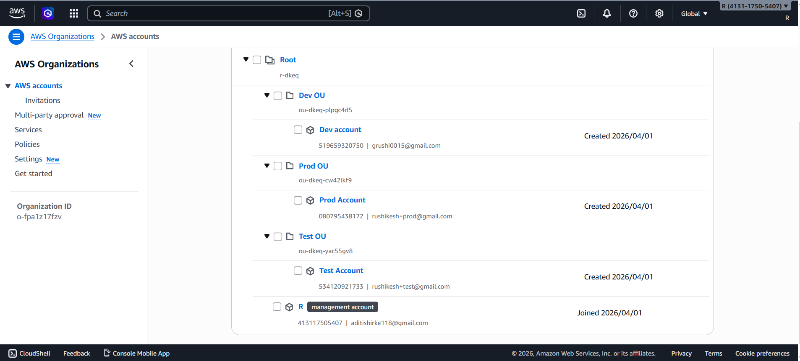
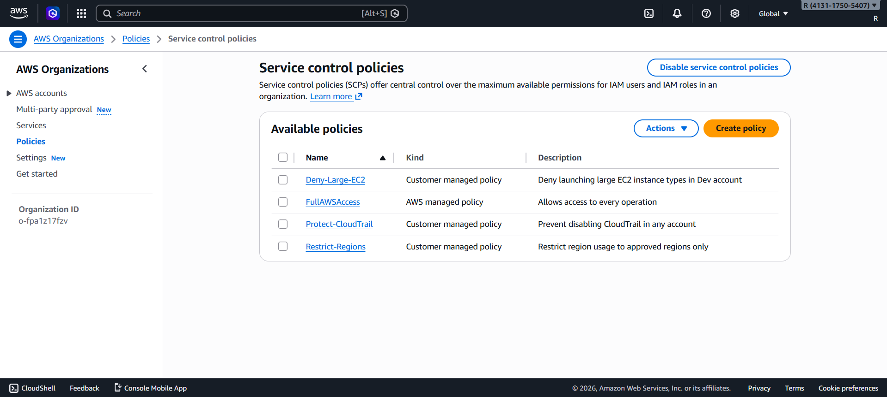
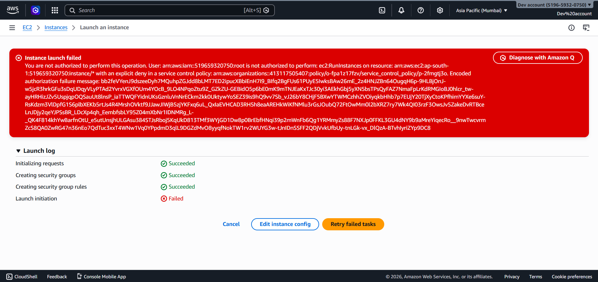
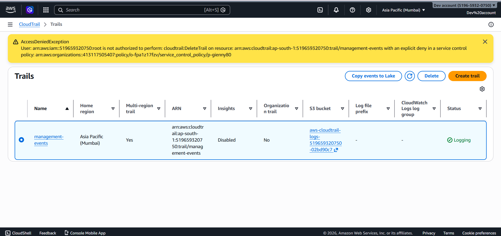
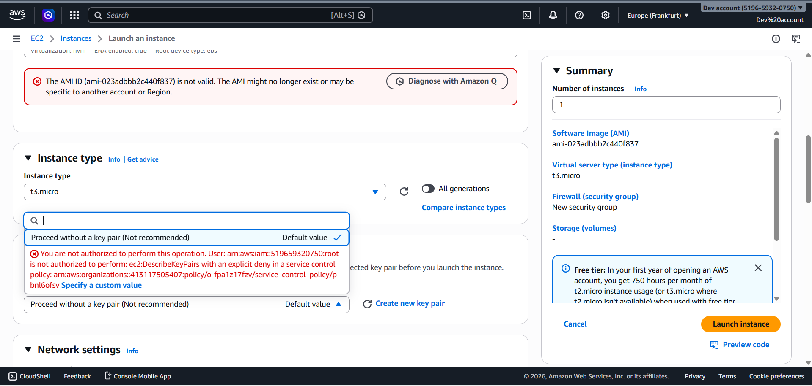

# Multi-Account AWS Governance using AWS Organizations & SCP

##  Description
This project demonstrates centralized governance across multiple AWS accounts using AWS Organizations, Organizational Units (OUs), and Service Control Policies (SCPs).

##  Objectives
- Implement multi-account architecture
- Apply security and cost control policies
- Restrict unauthorized actions
- Enable centralized logging using CloudTrail

##  Architecture
Root Account manages:
- Dev OU → Dev Account
- Test OU → Test Account
- Prod OU → Prod Account

SCP policies are applied at OU level.

##  SCP Policies

### 1. Deny Large EC2 in Dev
Prevents launching expensive EC2 instances in Dev account.

### 2. Restrict Regions
Allows only approved regions (ap-south-1, us-east-1).

### 3. Protect CloudTrail
Prevents disabling or deleting CloudTrail logs.

##  Tools & Technologies
- AWS Organizations
- Service Control Policies (SCP)
- IAM
- CloudTrail

##  Validation

### Test 1: EC2 Restriction
Attempted to launch m5.large instance in Dev account → ❌ Access Denied

### Test 2: CloudTrail Protection
Attempted to stop logging → ❌ Denied

### Test 3: Region Restriction
Tried using unapproved region → ❌ Denied

## 📸 Screenshots

### OU Structure

### SCP Attachment

### EC2 Denied

### CloudTrail Denied

### Region Denied

##  Challenges
- Understanding SCP behavior
- Cross-account access setup
- Debugging policy errors

##  Conclusion
- Centralized governance implemented
- Security improved
- Cost control enforced

##  Future Scope
- Automation using Terraform
- AWS Control Tower integration
